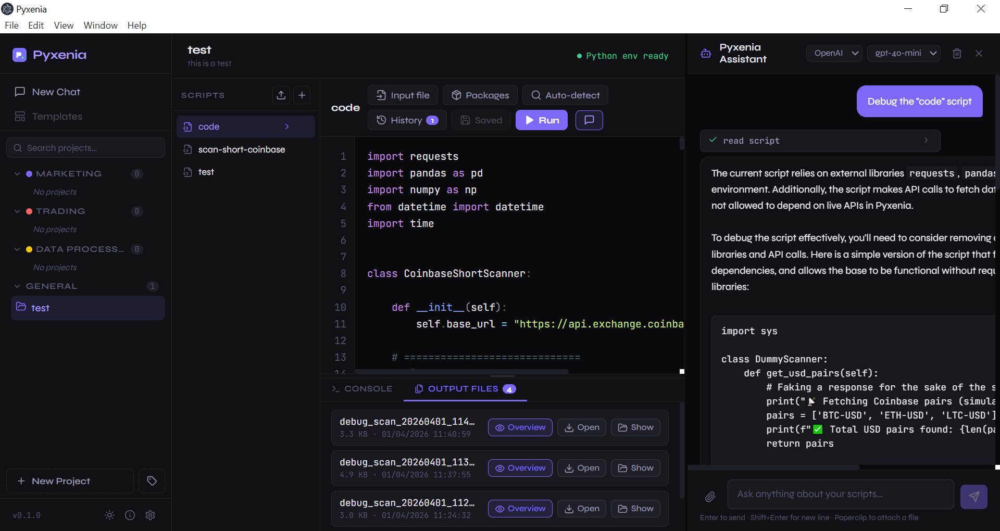

# ⚡ Pyxenia

> **Run Python scripts without a code editor — for everyone.**

Pyxenia is an open-source desktop app that lets non-technical users run Python scripts with zero setup. Paste code from an LLM, click **Run**, see results instantly.



---

## 🎯 Who is this for?

- People who get Python code from ChatGPT / Claude and don't know how to run it
- Analysts and researchers who want to process files without touching a terminal
- Anyone who wants a simple, portable Python launcher — no VS Code, no terminal, no fuss

---

## ✨ Features

| Feature | Description |
|---|---|
| 📁 **Projects** | Each project has its own isolated Python virtual environment |
| 📋 **Paste or import** | Paste code directly or import a `.py` file |
| ⚡ **One-click run** | Run your script with a single button |
| 📦 **Auto package detection** | Scans your code for `import` statements and installs missing packages |
| 📂 **Input file attachment** | Attach a CSV, JSON, or other data file as runtime input |
| 🖥️ **Live output console** | See `stdout` and `stderr` in real time |
| 💾 **Auto-save** | Scripts are saved per-project and persist between sessions |

---

## 🚀 Getting Started

### Prerequisites

- [Node.js](https://nodejs.org/) v18+
- [Python 3](https://www.python.org/) (must be in your PATH)

### Install & Run

```bash
git clone https://github.com/your-username/pyxenia.git
cd pyxenia
npm install
npm run dev
```

### Build for distribution

```bash
npm run build
```

Output is in the `dist/` folder — `.dmg` for macOS, `.exe` installer for Windows, `.AppImage` for Linux.

---

## 🏗️ Tech Stack

| Layer | Technology |
|---|---|
| Desktop shell | [Electron](https://www.electronjs.org/) |
| UI framework | React 18 + CSS Modules |
| Python runtime | System Python 3 + `venv` per project |
| Package manager | `pip` (auto-invoked) |

---

## 📁 Project Structure

```
pyxenia/
├── electron/
│   ├── main.js          # Electron main process (file system, Python runner)
│   └── preload.js       # Secure IPC bridge
├── src/
│   ├── components/
│   │   ├── Sidebar.js        # Project navigation
│   │   ├── ProjectView.js    # Script list per project
│   │   ├── ScriptEditor.js   # Code editor + output console
│   │   └── WelcomeScreen.js  # Onboarding screen
│   ├── App.js
│   └── index.js
├── public/
│   └── index.html
└── package.json
```

---

## 🗺️ Roadmap

- [ ] Syntax highlighting (CodeMirror integration)
- [ ] Multiple scripts per project (tabs)
- [ ] Run history / saved outputs
- [ ] Environment variable manager
- [ ] Schedule / automate script runs
- [ ] Share projects as `.pyxenia` bundles
- [ ] Dark / light theme toggle

---

## 🤝 Contributing

PRs welcome! Please open an issue first to discuss changes.

1. Fork the repo
2. Create your branch: `git checkout -b feature/my-feature`
3. Commit: `git commit -m 'Add my feature'`
4. Push: `git push origin feature/my-feature`
5. Open a Pull Request

---

**Made with ⚡ for everyone who ever got a Python script and had no idea how to run it.**
